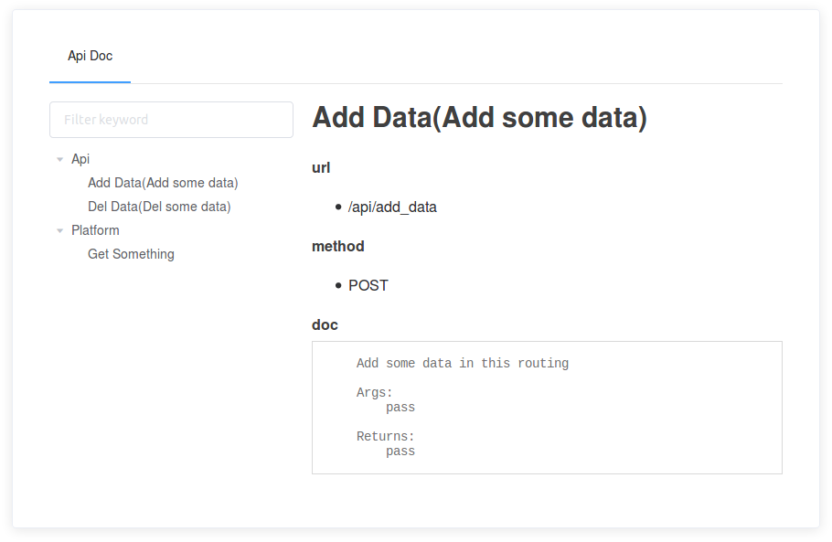
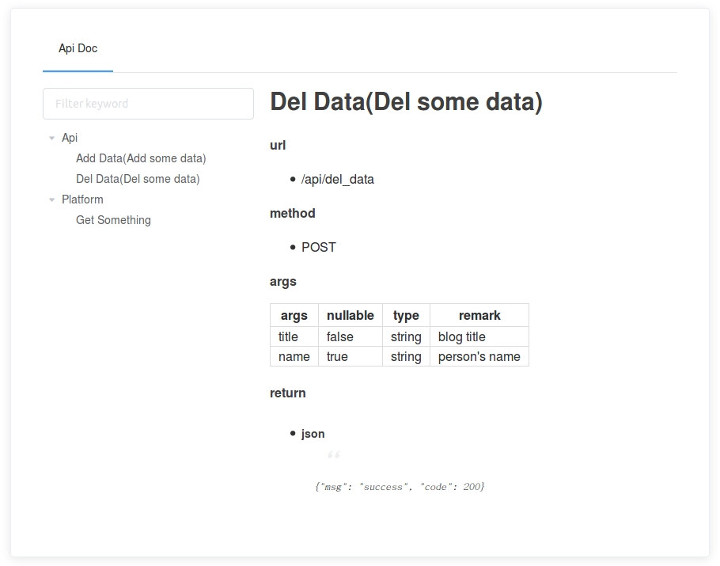
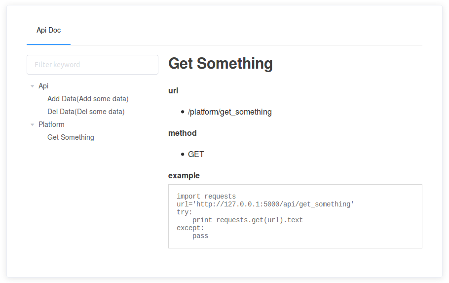
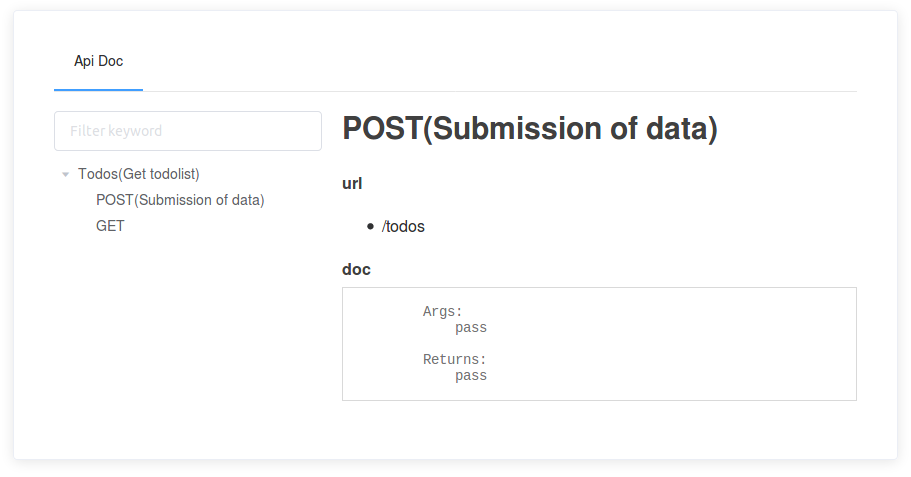
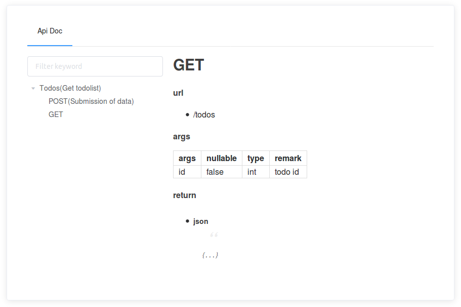

# Flask-Docs v0.1.4

> Adds Docs support to Flask.

[简体中文](README.zh-CN.md)

Features
-----

- Automatic generation of markdown documents
- Support Flask-RESTful
- Support for generating offline documents
- Support flask.views.MethodView

Usage
-----

Here is an example:

```python
from flask import Flask
from flask_docs import ApiDoc

app = Flask(__name__)

# Using CDN
# app.config['API_DOC_CDN'] = True

# Disable document pages
# app.config['API_DOC_ENABLE'] = False

# Api Document needs to be displayed
app.config['API_DOC_MEMBER'] = ['api', 'platform']

# Restful API documents to be excluded
app.config['RESTFUL_API_DOC_EXCLUDE'] = []

ApiDoc(app)
```

How to add markdown documents to the code:
```
@@@
# Write your markdown document here
@@@
```

# Run in /docs/api

Api and document pages
-----

```python
@api.route('/add_data', methods=['POST'])
def add_data():
    """Add some data

    Add some data in this routing

    Args:
        pass

    Returns:
        pass
    """
    return jsonify({'api': 'add data'})
```



```python
@api.route('/del_data', methods=['POST'])
def del_data():
    """Del some data

    @@@
    #### args

    | args | nullable | type | remark |
    |--------|--------|--------|--------|
    |    title    |    false    |    string   |    blog title    |
    |    name    |    true    |    string   |    person's name    |

    #### return
    - ##### json
    > {"msg": "success", "code": 200}
    @@@
    """
    return jsonify({'api': 'del data'})
```



````python
@platform.route('/get_something', methods=['GET'])
def get_something():
    """
    @@@
    #### example
    ```
    import requests
    url='http://127.0.0.1:5000/api/get_something'
    try:
        print requests.get(url).text
    except:
        pass
    ```
    @@@
    """
    return jsonify({'platform': 'get something'})
````



Flask-RESTful Api and document pages
-----

```python
from flask_restful import Resource, Api

class TodoList(Resource):
    """Manage todolist"""

    def post(self):
        """Submission of data

        Args:
            pass

        Returns:
            pass

        """
        return {'todos': 'post todolist'}

    def get(self):
        """
        @@@
        #### args

        | args | nullable | type | remark |
        |--------|--------|--------|--------|
        |    id    |    false    |    int   |    todo id    |

        #### return
        - ##### json
        > {...}
        @@@
        """
        return {'todos': 'get todolist'}


restful_api.add_resource(TodoList, '/todolist')
```





flask.views.MethodView Api
-----
> ***For the time being, only url_rule with the same class name are supported***

```python
from flask.views import MethodView

class TodoList(MethodView):
    """Manage todolist"""

    def put(self):
        """Change the data
        """
        return jsonify({'todos': 'put todolist'})

    def delete(self):
        """Delete the data
        """
        return jsonify({'todos': 'delete todolist'})


app.add_url_rule('/todolist/', view_func=TodoList.as_view('todolist'))
```

Examples
-----

[Complete example][examples]

Installation
-----

`pip3 install Flask-Docs`

Reference
-----

[flask_api_doc](https://github.com/tobyqin/flask_api_doc/)

[Flask-Bootstrap](https://github.com/mbr/flask-bootstrap/)

[examples]: https://github.com/kwkwc/flask-docs/tree/master/examples
