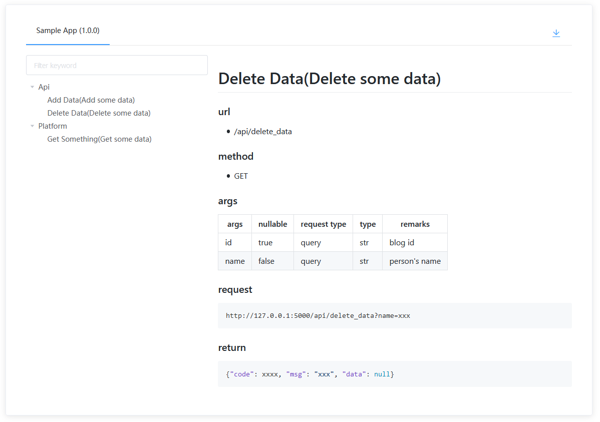

# Flask-Docs

[](https://github.com/kwkwc/flask-docs/actions/workflows/python-publish.yml)
[](https://coveralls.io/github/kwkwc/flask-docs?branch=master)
[](https://pypi.org/project/Flask-Docs/)

> Flask Api 文档自动生成插件

[English](README.md)

## 特性

- 根据代码注释自动生成文档
- 支持离线 markdown 文档下载
- 支持 Flask-RESTful
- 支持 flask.views.MethodView
- 支持在线调试

## 安装

`pip3 install Flask-Docs`

## 使用

```python
from flask import Flask
from flask_docs import ApiDoc

app = Flask(__name__)

# 使用 CDN
# app.config["API_DOC_CDN"] = True

# 禁用文档页面
# app.config["API_DOC_ENABLE"] = False

# 允许显示的方法
# app.config["API_DOC_METHODS_LIST"] = ["GET", "POST", "PUT", "DELETE", "PATCH"]

# 自定义 url_prefix
# app.config["API_DOC_URL_PREFIX"] = "/docs/api"

# 需要排除的 RESTful Api 类名小写
# app.config["API_DOC_RESTFUL_EXCLUDE"] = ["todo"]

# 需要显示的 Api 蓝图名称
app.config["API_DOC_MEMBER"] = ["api", "platform"]

# 需要排除的子成员 Api 函数名称
# app.config["API_DOC_MEMBER_SUB_EXCLUDE"] = ["delete_data"]

ApiDoc(
    app,
    title="Sample App",
    version="1.0.0",
    description="A simple app API",
)
```

## 如何书写 markdown 格式文档

```
@@@
在注释结尾用 “@@@” 包含 markdown 格式文档
@@@
```

## 查看文档页面

```
http://127.0.0.1/docs/api/
```

## Api demo

````python
@api.route("/add_data", methods=["POST"])
def add_data():
    """Add some data

    @@@
    ### args
    |  args | nullable | request type | type |  remarks |
    |-------|----------|--------------|------|----------|
    | title |  false   |    body      | str  | blog title    |
    | name  |  false   |    body      | str  | person's name |

    ### request
    ```json
    {"title": "xxx", "name": "xxx"}
    ```

    ### return
    ```json
    {"code": xxxx, "msg": "xxx", "data": null}
    ```
    @@@
    """
    return jsonify({"api": "add data"})
````


````python
@api.route("/delete_data", methods=["GET"])
def delete_data():
    """Delete some data

    @@@
    ### args
    |  args  | nullable | request type | type |  remarks     |
    |--------|----------|--------------|------|--------------|
    |  id    |  true    |    query     |  str | blog id    |
    |  name  |  false   |    query     |  str | person's name |

    ### request
    ```
    http://127.0.0.1:5000/api/delete_data?name=xxx
    ```

    ### return
    ```json
    {"code": xxxx, "msg": "xxx", "data": null}
    ```
    @@@
    """

    return jsonify({"api": "delete data"})
````



````python
@platform.route("/get_something", methods=["GET"])
def get_something():
    """Get some data

    @@@
    ### request example
    ```python
    import requests
    url="http://127.0.0.1:5000/platform/get_something"
    try:
        print(requests.get(url).text)
    except:
        pass
    ```

    ### return
    ```json
    {"code": xxxx, "msg": "xxx", "data": null}
    ```
    @@@
    """

    return jsonify({"platform": "get something"})
````


## Flask-RESTful Api demo

````python
from flask_restful import Resource, Api

class Todo(Resource):
    """Manage todo"""

    def post(self):
        """Add todo

        @@@
        ### description
        > Add todo

        ### args
        |  args | nullable | request type | type |  remarks |
        |-------|----------|--------------|------|----------|
        |  name |  false   |    body      | str  | todo name |
        |  type |  false   |    body      | str  | todo type |

        ### request
        ```json
        {"name": "xx", "type": "code"}
        ```

        ### return
        ```json
        {"code": xxxx, "msg": "xxx", "data": null}
        ```
        @@@
        """

        return {"todo": "post todo"}

    def get(self):
        """Get todo

        @@@
        ### description
        > Get todo

        ### args
        |  args | nullable | request type | type |  remarks |
        |-------|----------|--------------|------|----------|
        |  name |  false   |    query     | str  | todo name |
        |  type |  true    |    query     | str  | todo type |

        ### request
        ```
        http://127.0.0.1:5000/todo?name=xxx&type=code
        ```

        ### return
        ```json
        {"code": xxxx, "msg": "xxx", "data": null}
        ```
        @@@
        """

        return {"todo": "get todo"}


restful_api.add_resource(Todo, "/todo")
````


## flask.views.MethodView Api demo

> **_目前只支持与类名相同的 url_rule_**

```python
from flask.views import MethodView

class TodoList(MethodView):
    """Manage todolist"""

    def put(self):
        """Change the data
        """
        return jsonify({"todos": "put todolist"})

    def delete(self):
        """Delete the data
        """
        return jsonify({"todos": "delete todolist"})


app.add_url_rule("/todolist/", view_func=TodoList.as_view("todolist"))
```

## 装饰器 @ApiDoc.change_doc

> 复用注释

````python
from flask_docs import ApiDoc

return_json_str = '{"code": xxxx, "msg": "xxx", "data": null}'

@api.route("/add_data", methods=["POST"])
@ApiDoc.change_doc({"return_json": return_json_str})
def add_data():
    """Add some data

    @@@
    ### return
    ```json
    return_json
    ```
    @@@
    """
    return jsonify({"api": "add data"})


@api.route("/delete_data", methods=["GET"])
@ApiDoc.change_doc({"return_json": return_json_str})
def delete_data():
    """Delete some data

    return_json
    """

    return jsonify({"api": "delete data"})
````

## 调试器


## 示例

[完整示例][examples]

## 致谢

[flask_api_doc](https://github.com/tobyqin/flask_api_doc/)

[Flask-Bootstrap](https://github.com/mbr/flask-bootstrap/)

[github-markdown-css](https://github.com/sindresorhus/github-markdown-css/)

[Bytesize Icons](https://github.com/danklammer/bytesize-icons/)

[RESTClient](https://github.com/chao/RESTClient/)

[examples]: https://github.com/kwkwc/flask-docs/tree/master/examples
